# Developer Guide

## Table of Contents

1. [Acknowledgements](#acknowledgements)
2. [Design and Implementation](#design--implementation)
   - [Exception Hierarchy](#exception-hierarchy)
   - [Add Item Feature](#add-item-feature)
   - [Find Feature](#find-feature)
     - [Find By Expiry Date](#find-by-expiry-date)
     - [Find By Category](#find-by-category)
     - [Find By Bin](#find-by-bin)
     - [Find By Quantity](#find-by-quantity)
     - [Find By Keyword](#find-by-keyword)
   - [Update Item Feature](#update-item-feature)
   - [List Feature](#list-feature)
   - [Sort Feature](#sort-feature)
   - [Summary Feature](#summary-feature)
   - [Storage Feature](#storage-feature)
   - [Delete Feature](#delete-feature)
   - [Clear Feature](#clear-category-feature)
   - [Help Feature](#help-feature)
3. [Product Scope](#product-scope)
   - [Target User Profile](#target-user-profile)
   - [Value Proposition](#value-proposition)
4. [User Stories](#user-stories)
5. [Non-Functional Requirements](#non-functional-requirements)
6. [Glossary](#glossary)
7. [Instruction for Manual Testing](#instructions-for-manual-testing)
   - [Add Item](#testing-add-item)
   - [List Item](#testing-list-command)
   - [Find by Bin](#testing-find-by-bin)
   - [Find by Quantity](#testing-find-by-quantity)
   - [Find by Category](#testing-find-by-category)
   - [Find by Expiry Date](#testing-find-by-expiry-date)
   - [Update Item](#testing-update-feature)
   - [Sort Command](#testing-sort-command)
   - [Storage Feature](#testing-storage)
   - [Clear Category](#testing-clear-category)
   - [Find by Keyword](#testing-find-by-keyword)
   - [Summary](#testing-summary-command)

---


## Acknowledgements

This project is developed based on the concepts taught in CS2113. The overall architecture were inspired by
the [SE EDU AddressBook Level 3 project](https://se-education.org/addressbook-level3/).

## Design & implementation

This section describes the overall design of the application and how its main components interact.

The application follows a command-based architecture, where user input is parsed into commands that operate on the 
underlying data model. The system is structured into several key components:

- Parser: Interprets user input and constructs the appropriate command objects.
- Command: Encapsulates the logic to execute specific user operations.
- Model: Stores the inventory data, including categories and items.
- Storage: Handles reading from and writing to the storage file.
- UI: Manages all user's input and output.
  
When a user enters a command, the `Parser` interprets the input and returns a corresponding `Command` object. 
The `Command` is then executed, modifying the `Model` if necessary and delegating output to the `UI`. 
After execution, the updated state of the `Model` is saved by the `Storage` component.

This design enforces separation of concerns:
- Parsing logic is separated from execution logic.
- Data persistence is handled independently by the storage layer.

This modular structure improves maintainability and allows new features to be added with minimal impact on 
existing components.

The overall architecture of the application is shown below.


### Exception Hierarchy

The application uses a shared custom exception base class, `InventoryDockException`, so the main
runtime can catch command, parsing, and storage failures through a single type while still preserving
more specific subclasses for clearer intent.

The hierarchy is split into focused diagrams for each exception group.
This keeps the inheritance structure visible without forcing every detail into a single figure.

Parser and input exceptions:


Inventory lookup exceptions:

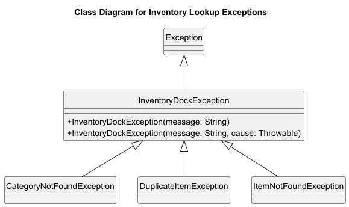

Storage exceptions:


### Add Item Feature

Another core feature of the product is the ability to add an item into an existing category using
the `add` command.

This feature is necessary because the application is fundamentally an inventory manager. Users need
to record newly stocked products together with shared fields such as name, quantity, bin location,
and expiry date, while also capturing category-specific boolean attributes such as `isRipe/` or
`isCarbonated/`. The add-item flow solves this by routing the same high-level command through specialised
parsers based on the category provided by the user.

For example, if the user enters
`add category/fruits item/apple bin/A-1 qty/10 expiryDate/2026-4-01 isRipe/true`,
the system validates the common and category-specific fields, constructs the correct `Item`
subclass, and adds it into the matching category.

#### High-level design

At a high level, this enhancement also fits into the existing command-based architecture of the
application. The feature follows this flow:

1. The user enters an `add` command.
2. `Parser` recognises the `add` command word and delegates the remaining input to `AddCommandParser`.
4. `AddItemCommandParser` dispatches to the category-specific parsing path, parses the boolean field, and constructs the
   correct `Item` subtype.
   correct `Item` subtype.
5. An `AddItemCommand` is created and executed with access to the current `Inventory` and `UI`.
6. The command finds the target category, rejects duplicate logical batches using a normalized identity key (ignoring `qty/` and `bin/`), then inserts the item and shows a confirmation message.

Sequence diagrams:

1. Parse routing and category dispatch.


2. Single-category parsing and command creation.

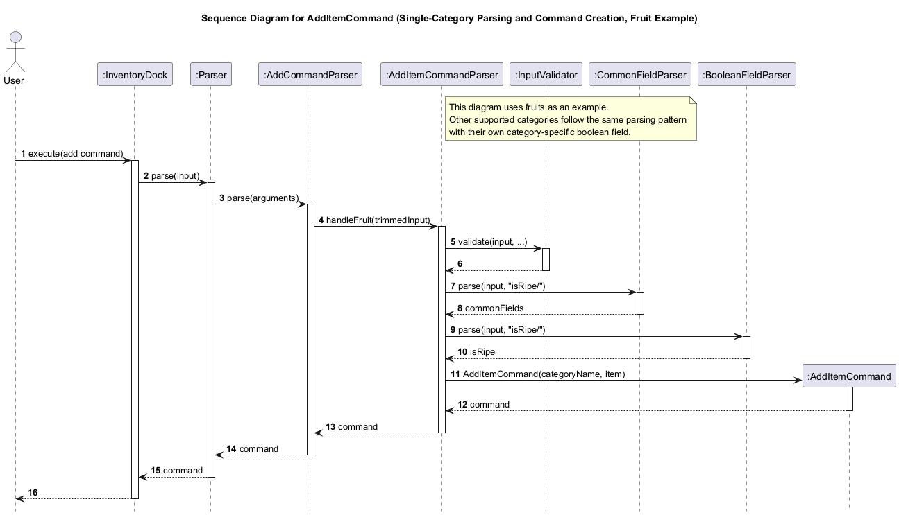

3. Command execution and user display.


The main structural relationships for this feature are shown below.


A representative object snapshot for this feature is shown below.


This design was chosen because it preserves the same separation of responsibilities used elsewhere
in the codebase:

- `Parser` and parser helpers interpret user input.
- `AddItemCommand` performs duplicate checks and inventory mutation.
- Model classes such as `Inventory`, `Category`, and `Item` hold the application state.
- `UI` presents confirmation messages to the user.

As a result, adding a new item subtype does not require redesigning the command pipeline. The parser
layer can be extended category by category while the execution model remains unchanged.

#### Component-level implementation

The feature is mainly implemented using the following classes:

- `Parser`
- `AddCommandParser`
- `AddItemCommandParser`
- `BooleanFieldParser`
- `AddItemCommand`
- `Inventory`
- `Category`
- `Item`

The responsibilities of these classes are as follows:

- `Parser` identifies that the user wants to perform an add operation.
- `AddCommandParser` validates shared required fields and chooses the correct parsing branch based on
  `category/`.
- `AddItemCommandParser` coordinates common-field parsing and boolean-field parsing.
- `BooleanFieldParser` parses and validates the single boolean field required by each concrete `Item` subtype.
- `AddItemCommand` performs duplicate-batch checking and insertion into the inventory.
- `Inventory` finds the matching category by name.
- `Category` stores the added item.
- `Item` and its subclasses represent the domain object being created.

This design intentionally separates shared parsing from category-specific parsing. Common fields such
as `item/`, `bin/`, `qty/`, and `expiryDate/` can be handled consistently, while subtype-specific
the boolean category field remains encapsulated in the relevant parser and model class.

#### Command execution flow

When the user enters an add command, the implementation performs the following sequence:

1. `Parser.parse()` splits the command word from the arguments.
2. `Parser` calls `AddCommandParser.parse(arguments)`.
3. `AddCommandParser` checks that `category/` is present and dispatches to the correct category branch.
4. `AddCommandParser` extracts the category and dispatches to the corresponding method in
   `AddItemCommandParser`.
5. `AddItemCommandParser` validates the input, parses common fields, and invokes the category-specific
   parser.
6. `AddItemCommandParser` creates an `Item` subtype and wraps it in an `AddItemCommand`.
7. `InventoryDock` executes `AddItemCommand.execute(inventory, ui)`.
8. `AddItemCommand` calls `inventory.findCategoryByName(categoryName)`.
9. If the category exists, `AddItemCommand` computes a normalized batch-identity key for the new item.
10. `AddItemCommand` scans existing items in the same category and compares normalized keys.
11. The normalized key ignores `qty/` and `bin/`, and compares the remaining stored fields.
12. If a duplicate batch is found, `AddItemCommand` throws `DuplicateItemException` with
    `Duplicate item found for category/<category> item/<item>.`.
13. If no duplicate is found, `AddItemCommand` calls `category.addItem(item)`.
14. `UI.showItemAdded(...)` displays the confirmation to the user.

The execution logic in `AddItemCommand` keeps validation and mutation together:

```java
Category category = inventory.findCategoryByName(categoryName);
Item duplicateItem = findDuplicateItem(category, item);
if (duplicateItem != null) {
    throw new DuplicateItemException("Duplicate item found for category/"
            + category.getName() + " item/" + item.getName() + ".");
}
category.addItem(item);
ui.showItemAdded(item.getName(), item.getQuantity(),
        category.getName(), item.getBinLocation());
```

This keeps construction concerns in the parser layer and duplicate/mutation concerns in the command layer.

#### Why the feature is implemented this way

The main design choice is the use of category-based dispatch in `AddCommandParser` and
`AddItemCommandParser` instead of one very large parser or category-agnostic item builder.

This was chosen for three reasons.

First, different item types do not share the same attributes. Separating parsers by category keeps
validation rules close to the subtype that needs them.

Second, it improves maintainability. Adding support for a new category mostly requires introducing a
new parser branch and item subtype rather than modifying one monolithic parsing method with many
special cases.

Third, it keeps command execution simple. By the time `AddItemCommand` runs, all parsing and object
construction work has already been completed. The command only needs to find the category, validate duplicate batch rules, and append
the item.

Another deliberate design choice is that the command adds only into an existing category rather than
creating a missing category automatically. This keeps category creation rules explicit and avoids
silently introducing unintended categories due to typing errors.

#### Error handling and validation

Validation is split across the parser layer.

`AddCommandParser` rejects missing `category/` before dispatching to a category-specific parser.
The category-specific parser path then uses `InputValidator`, `CommonFieldParser`, and
`BooleanFieldParser` to validate the remaining required fields. Missing-field failures are reported
using `MissingArgumentException`, while unsupported categories are reported using
`InvalidCommandException`.

`AddItemCommandParser` and the specialised parsers validate category-specific input. If required
fields are missing or malformed, they throw `InventoryDockException` before an `AddItemCommand` is created.

`AddItemCommand` also performs execution-time checks. If `inventory.findCategoryByName(categoryName)`
returns `null`, the command throws a `CategoryNotFoundException` with the message
`Category not found: <categoryName>`. If the parsed item is unexpectedly 
`null`, it throws a `MissingArgumentException` with the message `Item cannot be null.` It also
checks for duplicate batches in the same category using normalized identity keys (ignoring `qty/`
and `bin/`) and throws `DuplicateItemException` with
`Duplicate item found for category/<category> item/<item>.` when a duplicate is detected.

This layered approach ensures invalid input is rejected as early as possible, while still protecting
the command layer from invalid state.

### Find Feature

The product provides a family of `find` commands that share a common flow:

1. `FindItemParser` reads the find prefix and value.
2. The parser constructs a find-specific command.
3. The command executes against `Inventory`.
4. Results are displayed through `UI`.

This section consolidates all find subfeatures and highlights only each subfeature's unique matching logic.

Contributor acknowledgement for this Find section:
- Find by category and find by bin: Wang Chuhao.
- Find by quantity: Luke Louyu.
- Find by keyword: KOIiiii07.
- Find by expiry date: Yeo Si Zhao.

#### Find By Expiry Date

Command format: `find expiryDate/DATE`

Contributed by: Yeo Si Zhao.

Sequence diagrams:

1. Parse and command creation.


2. Date parsing and matching.

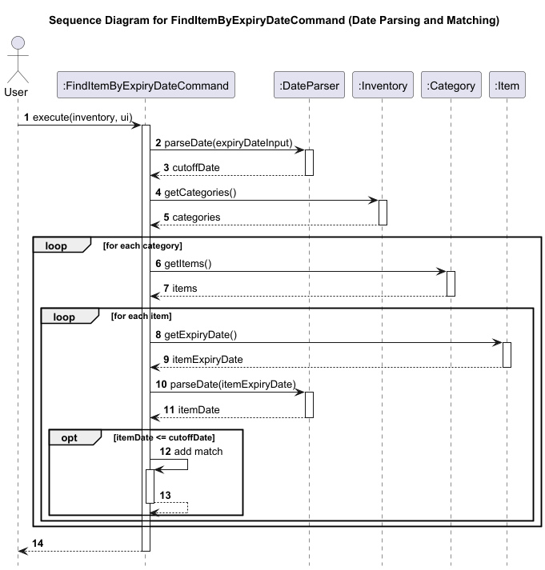

3. Result display.

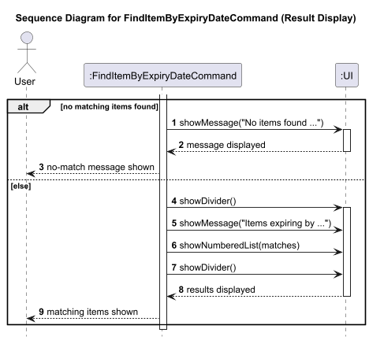

Class and object diagrams:


#### Find By Category

Command format: `find category/CATEGORY`

Contributed by: Wang Chuhao.

Sequence diagrams:

1. Parse and command creation.


2. Category lookup.


3. Result display.


Class and object diagrams:


#### Find By Bin

Command format: `find bin/BIN`

Contributed by: Wang Chuhao.

Sequence diagrams:

1. Parse and command creation.


2. Inventory scan and bin matching.


3. Result display.


Class and object diagrams:


#### Find By Quantity

Command format: `find qty/QUANTITY`

Contributed by: Luke Louyu.

Sequence diagrams:

1. Parse and command creation.


2. Inventory scan and quantity matching.

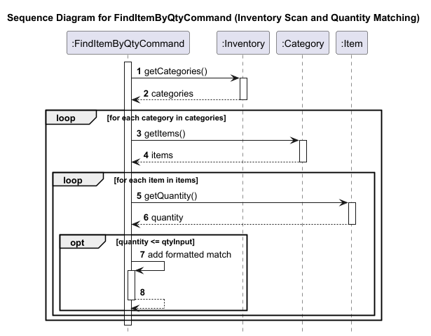

3. Result display.

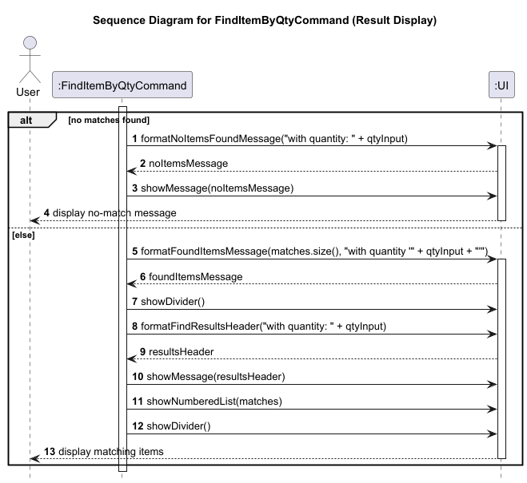

Class and object diagrams:


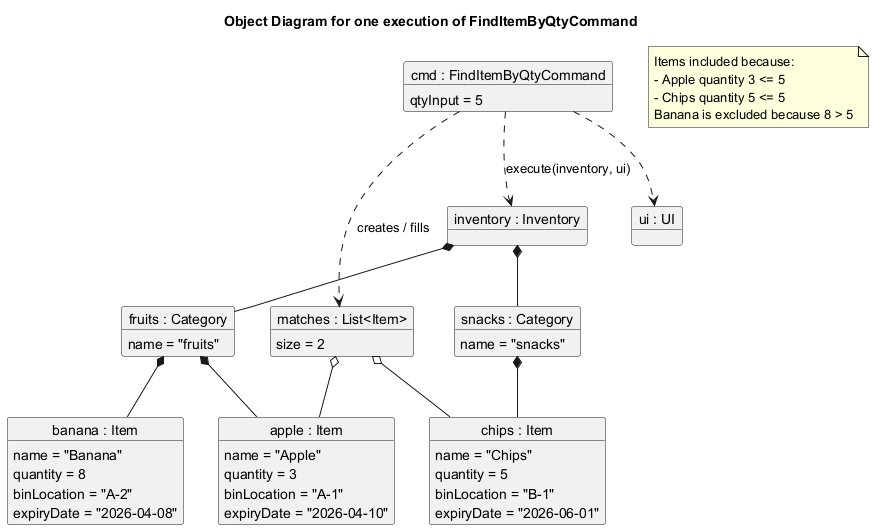

#### Find By Keyword

Command format: `find keyword/KEYWORD`

Contributed by: KOIiiii07.

Sequence diagrams:

1. Parse and command creation.


2. Inventory scan and keyword matching.


3. Result display.


Class and object diagrams:


### Update Item Feature

Another core feature of the product is the ability to update an existing item in a category using the
`update` command.

This feature is necessary because inventory records may change over time. A user may need to correct an
item name, adjust its quantity, move it to a different bin location, or revise its expiry date. Without
an update operation, the user would have to delete the item and recreate it manually, which is less
efficient and more error-prone. The update-item command solves this by allowing selected fields of an
existing item to be modified directly.

For example, if the user enters  
`update category/fruits index/1 qty/20 expiryDate/2026-4-15`,  
the system locates the first item in the fruits category and updates its quantity and expiry date  
while leaving its other fields unchanged.

#### High-level design

At a high level, this feature fits into the same command-based architecture used throughout the
application. The flow is as follows:

* The user enters an `update` command.
* Parser recognises the `update` command word and delegates the remaining input to `UpdateCommandParser`.
* `UpdateCommandParser` extracts the category, item index, and the fields to be updated.
* The parser creates an `UpdateItemCommand`.
* The command is executed with access to the current `Inventory` and `UI`.
* The command locates the target category and item, applies the requested updates, and shows a
  confirmation message.

This design was chosen because it preserves the same separation of concerns already used by the rest
of the application:

* Parsers interpret user input.
* Command classes implement behaviour.
* Model classes store inventory data.
* UI displays the final result.

As a result, the update feature integrates cleanly into the existing command pipeline without requiring
a separate editing subsystem.

The main interaction for this flow is illustrated below.


The main structural relationships for this feature are shown below.


A representative object snapshot for this feature is shown below.


#### Component-level implementation

The feature is mainly implemented using the following classes:

* `Parser`
* `UpdateCommandParser`
* `UpdateItemCommand`
* `Inventory`
* `Category`
* `Item`
* `CommonFieldParser`
* `UI`

The responsibilities of these classes are as follows:

* `Parser` detects the update command word and delegates to `UpdateCommandParser`.
* `UpdateCommandParser` tokenises the input, validates `category/` and `index/`, validates `bin/`
  early using the same exact-format rule as `add`, collects the updated fields into a
  `Map<String, String>`, and constructs an `UpdateItemCommand`.
* `UpdateItemCommand` locates the item, applies the requested changes, rolls back on validation
  failure, and rejects duplicate-batch collisions.
* `Inventory` provides category lookup using `findCategoryByName(...)`.
* `Category` provides indexed item access through `getItem(...)`.
* `Item` provides setter methods such as `setName(...)`, `setQuantity(...)`, `setBinLocation(...)`,
  and `setExpiryDate(...)`.
* `CommonFieldParser` is reused for quantity and expiry-date validation so that update validation stays
  consistent with add-command validation.
* `UI` displays the result after the update is completed.

This design intentionally separates parsing from mutation. The parser determines what should be updated,
while the command is responsible for locating the correct item and applying the changes.

#### Command execution flow

When `UpdateItemCommand.execute()` is called, the implementation performs the following sequence:

* Assert that `inventory` and `ui` are not null.
* Call `inventory.findCategoryByName(categoryName)` to locate the target category.
* If the category is not found, throw a `CategoryNotFoundException`.
* Validate that the provided `itemIndex` is within the valid range for that category.
* Retrieve the target item using `category.getItem(itemIndex - 1)`.
* Store the original item name for display purposes.
* Capture an item snapshot so the original state can be restored if validation later fails.
* Call `applyUpdates(item)`.
* Iterate through each entry in the updates map.
* Match each field name using a switch statement.
* Apply the corresponding update to the item.
* Compare the updated item against the other items in the same category using the duplicate-batch key.
* If a duplicate batch is detected, restore the original values and throw `DuplicateItemException`.
* After all updates are applied successfully, call `ui.showItemUpdated(...)`.

The central logic is:

```java
Category category = inventory.findCategoryByName(categoryName);
if (category == null) {
   throw new CategoryNotFoundException("Category '" + categoryName + "' does not exist.");
}

if (itemIndex < 1 || itemIndex > category.getItemCount()) {
   throw new ItemNotFoundException(
           "Item at index " + itemIndex + " not found in category '" + categoryName + "'.");
}

Item item = category.getItem(itemIndex - 1);
String originalName = item.getName();
ItemSnapshot snapshot = ItemSnapshot.from(item);
applyUpdates(item);
Item duplicateItem = findDuplicateItem(category, item);
if (duplicateItem != null && duplicateItem != item) {
   restoreOriginalValues(item, snapshot);
   throw new DuplicateItemException("Duplicate item found for category/"
           + category.getName() + " item/" + item.getName() + ".");
}
ui.showItemUpdated(originalName, item.getName(), category.getName());
```

#### Why the feature is implemented this way

The most important design choice in this feature is that the parser stores updates in a  
`Map<String, String>` rather than creating a different command class for every possible update  
combination.

This was chosen for three reasons.

* First, it keeps the parsing logic flexible. A user may update one field or several fields in a single  
  command, and a map allows the parser to capture all requested updates without requiring a separate  
  representation for every case.

* Second, it keeps the command extensible. New updatable fields can be added by extending the switch  
  statement inside `applyUpdates(...)` instead of redesigning the overall feature.

* Third, it avoids unnecessary duplication. The same update mechanism can handle name, quantity, bin, and  
  expiry date changes in one place.

Another deliberate design choice is reusing existing validation helpers such as  
`CommonFieldParser.parseQuantity(...)` and `CommonFieldParser.validateExpiryDate(...)`. This ensures  
that update commands follow the same validation rules as add commands, which improves consistency across  
the application.

The parser also validates `bin/` eagerly using `BinLocationParser.parseExactInput(...)`. This keeps
update behaviour aligned with add behaviour, so malformed bin values are rejected before command
execution begins.

#### Error handling and validation

Validation is split across the parser layer and the command layer.

`UpdateCommandParser` handles syntax-level validation. It rejects:

* empty update input  
* malformed tokens without a valid `/` separator  
* missing `category/`  
* missing `index/`  
* non-integer item indices  
* non-positive item indices  
* update commands that do not specify any fields to change
* malformed `bin/` values such as `A2`

`UpdateItemCommand` handles execution-time validation. It rejects:

* missing categories  
* invalid item indices for the chosen category  
* unsupported update fields  
* update operations that would collide with an existing duplicate batch  
* empty updated names or empty bin locations  
* invalid quantities  
* invalid expiry-date values  

This layered design ensures invalid input is rejected early, while still protecting the command layer  
from invalid runtime state.

---

### List Feature

The product also supports displaying the current inventory using the `list` command.

This feature is important because users need a quick way to inspect the complete inventory after
adding, updating, deleting, or loading items from storage. Unlike targeted search commands, the list
operation provides a full snapshot of the current inventory state grouped by category.

For example, after a sequence of inventory changes, the user can enter `list` to review all categories
and their stored items in one output.

#### High-level design

At a high level, the feature is intentionally minimal and fits directly into the existing command
architecture:

1. The user enters a `list` command.
2. `Parser` recognises the command word and constructs a `ListCommand`.
3. `InventoryDock` executes the command with the current `Inventory` and `UI`.
4. `ListCommand` delegates rendering to `UI.showInventory(inventory)`.
5. `UI` iterates through the inventory and prints the formatted listing to the user.

This design was chosen because listing inventory does not require separate parsing logic beyond
recognising the command word. The command object acts mainly as a bridge between the parser and the UI.

The main structural relationships for this feature are shown below.


A representative object snapshot for this feature is shown below.


The main interaction for this flow is illustrated below.

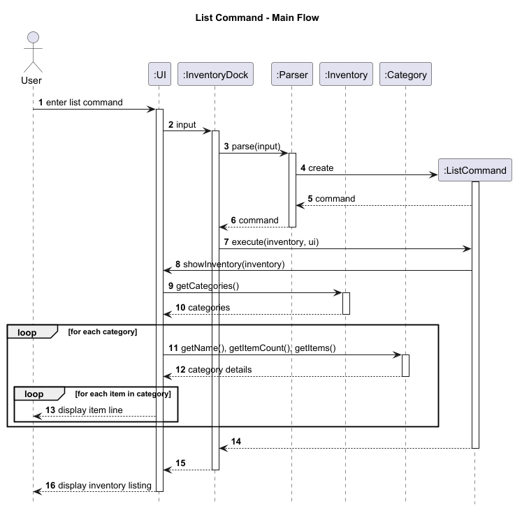

#### Component-level implementation

The feature is mainly implemented using the following classes:

- `Parser`
- `ListCommand`
- `Inventory`
- `Category`
- `UI`

The responsibilities of these classes are as follows:

- `Parser` detects the `list` command and returns a new `ListCommand`.
- `ListCommand` represents the list operation and triggers the display behaviour.
- `Inventory` provides access to the stored categories.
- `Category` provides the items and summary information for each category.
- `UI` formats and prints the inventory contents.

This design keeps the command itself lightweight. Since listing is a read-only operation, most of the
formatting logic appropriately lives in the UI layer instead of the command layer.

#### Command execution flow

When `ListCommand.execute()` is called, the implementation performs the following sequence:

1. Assert that `inventory` and `ui` are not 
ull`.
2. Log that the inventory listing is being requested.
3. Call `ui.showInventory(inventory)`.
4. Inside the UI layer, retrieve all categories from the `Inventory`.
5. Iterate through each `Category`.
6. For each category, display its name, item count, and items.
7. Print the combined inventory listing to the user.

The command logic is intentionally short:

```java
logger.log(Level.INFO, "Listing inventory.");
ui.showInventory(inventory);
```

This reflects the design decision that `ListCommand` should trigger the operation, while formatting and
presentation remain the responsibility of the UI.

#### Why the feature is implemented this way

The most important design choice here is that `ListCommand` delegates almost all work to the UI layer
instead of assembling formatted output by itself.

This was chosen for two reasons.

First, it preserves separation of concerns. The command layer decides what action should happen, while
the UI layer decides how the result should be shown.

Second, it keeps the read-only command easy to maintain. Since `list` does not modify state, there is
no need for extra model logic or intermediate data transformation in the command itself.

This also makes the command consistent with other parts of the application where `UI` is responsible
for user-facing output.

#### Error handling and validation

The `list` command has minimal input validation because it takes no arguments.

`Parser` handles recognition of the command word. Once a `ListCommand` is created, the main runtime
checks are the assertions in `ListCommand.execute()` that ensure `inventory` and `ui` are not 
ull`.

Because the command is read-only and does not parse additional user arguments, there are fewer failure
modes compared with commands such as `add` or `find`.

### Sort Feature

The product also supports displaying the current inventory with items sorted within each category using 
the `sort` command.

This feature is useful because users may want to inspect the inventory from a different perspective without changing 
the actual stored order of items. For example, if the user enters`sort expirydate`, the system displays all categories 
as usual, but the items inside each category are shown in ascending expiry date order, allowing the user to quickly 
identify items that are expiring soon.

#### High-level design

This feature extends the existing command-based architecture used by the product. The flow is as follows:

1. The user enters a `sort` command followed by a sort type.
2. `Parser` recognises the sort command word and delegates the argument to `SortCommandParser`.
3. `SortCommandParser` validates the sort type and creates a `SortCommand`.
4. `InventoryDock` executes the command with access to the current `Inventory` and `UI`.
5. `SortCommand` prepares the sorted view of the inventory.
6. `UI` displays the sorted inventory while preserving the group by category structure.

This design was chosen because it keeps sorting behaviour within the normal parse then execute command pipeline
used throughout the application. It also allows the feature to reuse the existing inventory display format instead of
introducing a completely separate output style.

#### Component-level implementation

The feature is implemented using the following and their responsibilities are as follows:

- `Parser` detects the `sort` command and delegates argument parsing to `SortCommandParser`.
- `SortCommandParser` validates the user supplied sort type and constructs the corresponding command.
- `SortCommand` performs the sorting preparation and triggers the display behaviour.
- `Inventory` provides access to the currently stored categories.
- `Category` provides access to the items stored under each category.
- `Item` provides the fields used for comparison such as name, expiry date and quantity.
- `UI` formats and prints the sorted inventory view.

This design keeps parsing, sorting and presentation responsibilities separate, The parser only interprets
the command, the command prepares the sorted result and the UI remains responsible for rendering it.

The main structural relationships for this feature are shown below.


#### Command execution flow

When `SortCommand.execute()` is called the implementation performs the following sequence:

1. Assert that `inventory`, `ui` and `sortType` are not 
ull`.
2. Retrieve all categories from the `Inventory`.
3. For each category, make a copy of items item list.
4. Sort the copied list using the comparator that matches the requested sort type.
5. Store the sorted lists in the same category order as the original inventory.
6. Call `ui.showSortedInventory(inventory, sortedItemsByCategory, sortLabel)`.
7. UI displays the categories in their original order and prints each category's sorted item list.

This means the command does not directly modify the order of items stored inside the actual inventory. Instead, it
prepares a sorted view for display.

The sort feature can be understood as three smaller interactions: parsing the command, preparing the sorted view, 
and displaying the sorted inventory.

The parsing and command creation flow is shown below.


The sorting preparation flow is shown below.


The sorted inventory display flow is shown below.


A representative object snapshot for this feature is shown below.


#### Sorting logic

The sorting behaviour depends on the user provided sort type.

- 
ame`: Sorts items alphabetically by item name, ignoring letter case.
- `expirydate`: Sorts items by expiry date in ascending order, so earlier expiry dates appear first.
- `qty`: Sorts items by quantity in descending order, so larger quantities appear first.

For expiry-date sorting, the command relies on date parsing rather than raw string comparison. This is important
because proper date parsing ensures dates are compared logically rather than lexicographically.

A simplified version of the sorting approach is:

```java
List<Item> sortedItems = new ArrayList<>(category.getItems());
sortedItems.sort(getComparator());
```

The sorted item lists are then passed to the UI for display.

#### Why the feature is implemented this way

The most important design choice in this feature is that sorting is performed on copied item lists instead of
changing the order of items inside the actual inventory.

This was chosen for two reasons.

First, the feature is intended to provide an alternative view of the inventory rather than mutate the underlying data.
A user who runs `sort name` is usually asking to inspect the data in a different order, not to permanently reorder the
stored inventory.

Second, it avoids unintended side effects. If the underlying item order were modified directly, later commands that
depend on the original ordering, such as deletion or updating by index, could behave differently in ways the user
did not expect.

#### Error handling and validation

Input validation is handled mainly by `SortCommandParser`.

If the user enters `sort` without providing a sort type, the parser throws a `MissingArgumentException` indicating 
that a valid sort type is required.

If the user provides an unsupported sort type, the parser throws a `InvalidCommandException` listing the valid options,
such as `name`, `expirydate`, and `qty`.

At execution time, the command handles an empty inventory gracefully. The UI displays the appropriate empty inventory
message instead of failing.

### Summary Feature

The product also supports displaying a category based summary of the current inventory using the `summary` command. 
This feature is useful when the user wants a quicker overview of important inventory information. 
Instead of showing every item directly, the command summarises each category using item count, lowest stock, and 
earliest expiry date.

The feature supports three command forms:
* `summary` which displays both tied lowest stock items and tied earliest expiry items for each category.
* `summary stock` which displays only the tied lowest stock items for each category.
* `summary expirydate` which displays only the tied earliest expiry items for each category.

#### High-level design

At a high level, this feature fits into the same command based architecture used throughout the application. The flow is as follows:

1. The user enters a `summary` command with an optional mode.
2. `Parser` recognises the command word and delegates the argument to `SummaryCommandParser`.
3. `SummaryCommandParser` validates the argument and creates a `SummaryCommand`.
4. `SummaryCommand` scans each category in the inventory and prepares the summary data.
5. `UI` displays the summary view.

The main structural relationships for the storage feature are shown below.


#### Implementation details

The feature is mainly implemented using the following classes: `Parser`, `SummaryCommandParser`, `SummaryCommand`,
`Inventory`, `Category`, `Item`, `DateParser`, `UI`.

For stock summary, the command finds the minimum quantity in each category and collects all items tied at that value. 
For expiry date summary, the command parses item expiry dates using `DateParser`, determines the earliest valid date 
in each category, and collects all items tied at that date.

#### Why the feature is implemented this way

The summary feature is designed to complement `list`, not replace it. While `list` is useful when the user wants to 
inspect the full inventory, `summary` is more useful when the user wants to identify categories that may need attention.
Separating the feature into `summary`, `summary stock`, and `summary expirydate` also keeps the command flexible while 
keeping the interface simple.

#### Command execution flow

When the user enters a summary command, the implementation performs the following sequence:

1. `Parser` recognises the `summary` command and delegates the optional argument to `SummaryCommandParser`.
2. `SummaryCommandParser` validates the mode and creates a `SummaryCommand`.
3. `SummaryCommand.execute()` retrieves the categories from `Inventory`.
4. For each category, the command collects the relevant items based on the selected summary mode:
    * tied lowest stock items for `summary stock`
    * tied earliest expiry items for `summary expirydate`
    * both groups for `summary`
5. `SummaryCommand` passes the prepared summary data to `UI`.
6. `UI` formats and displays the summary view.

The main interaction for this flow is illustrated below.

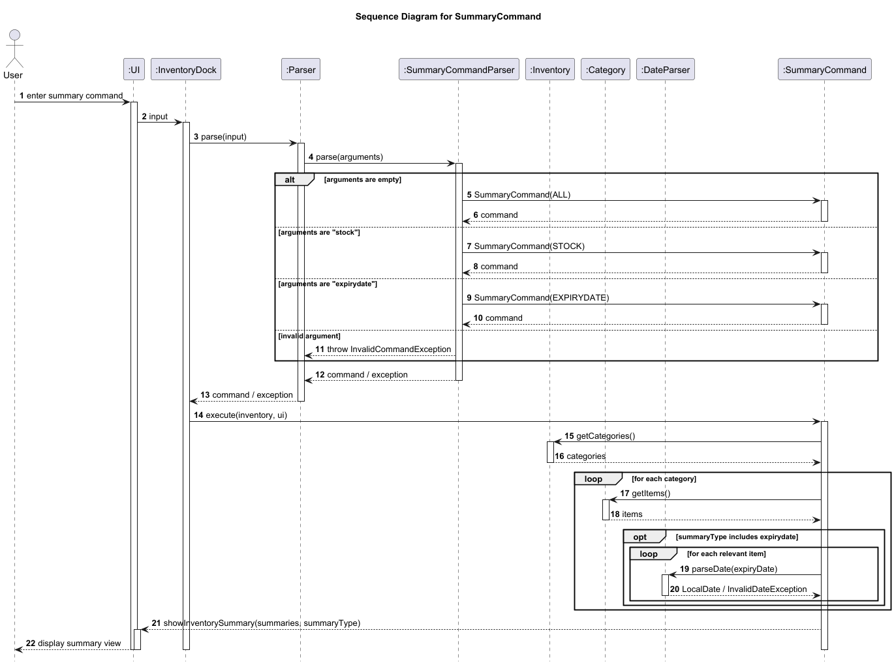

### Storage feature

This product includes a storage component that is responsible for persisting inventory data between application 
sessions. This is necessary because users should be able to continue from their previous inventory state after 
closing and reopening the application. The storage mechanism is facilitated by `Storage`, which is responsible for 
saving the current `Inventory` to file and loading it back when the application starts.

#### Implementation

It supports two main operations:

- `save(Inventory inventory)` which writes the current inventory to the storage file.
- `load(Inventory inventory, UI ui)` which reads the storage file and reconstructs the inventory state.

If the storage file does not exist, the application starts with an empty inventory and creates the file automatically.
If a line is malformed, the exception is caught and the line is skipped. The user is informed through the UI,
together with the reason the line was skipped.

The main structural relationships for the storage feature are shown below.


#### Saving execution flow

When the application saves, `Storage` performs the following sequence:

1. Traverse all items in each categories in `Inventory`.
2. Convert each item into its storage format using `toStorageString(categoryName)`. 
3. Write the resulting lines to the storage file.

The main interaction for this flow is illustrated below.


#### Loading execution flow

When the application loads data from file, `Storage` performs the following sequence:

1. Read the file line by line. 
2. Reuse the add item parsing flow to reconstruct each stored item. 
3. Execute the parsed command to rebuild the inventory state in memory. 
4. Skip malformed lines where appropriate and continue loading the remaining valid lines.

The main interaction for this flow is illustrated below.


#### Why the storage component is implemented this way

A simple text-based format is used because it is lightweight, easy to inspect during debugging, and does not require 
external libraries or database setup. Reusing the existing add-item parsing flow also avoids duplicating parsing 
logic and helps keep storage behaviour consistent with normal command handling.

### Delete Feature

Command format: `delete category/CATEGORY index/INDEX`
Removes a single item at the given 1-based index from the specified category. The command looks up the category via `inventory.findCategoryByName(...)`, validates the index range, retrieves the item with `category.getItem(itemIndex - 1)`, removes it with `category.removeItem(...)`, and shows a confirmation message.
Validation is layered: `DeleteCommandParser` rejects missing fields, non-integer indices, and non-positive integers at parse time. `DeleteItemCommand` catches non-existent categories and out-of-range indices at execution time.

Sequence diagram:


Class and object diagrams:


### Clear Category Feature

Command format: `clear category/CATEGORY`
Clears all items within the specified category. Because this is a higher-risk operation, the command prompts the user for confirmation (must type `yes`, case-insensitive) before proceeding. If the category is already empty, a message is shown and the command returns early without prompting.
The `clear` command uses a separate parser flow from `delete`:
1. `Parser` recognises the `clear` command word and delegates to `ClearCommandParser`.
2. `ClearCommandParser` extracts the `category/` field and creates a `ClearCategoryCommand`.
3. The command executes against `Inventory` and displays results through `UI`.

The core execution logic:
```java
if (category.isEmpty()) {
    ui.showCategoryAlreadyEmpty(categoryName);
    return;
}

ui.showClearCategoryConfirmation(categoryName, category.getItemCount());
String response = ui.readCommand();

if (response == null || !response.trim().equalsIgnoreCase("yes")) {
    ui.showClearCategoryCancelled(categoryName);
    return;
}

category.getItems().clear();
ui.showCategoryItemsCleared(categoryName);
ui.showCategoryCleared(categoryName);
```

Sequence diagram:
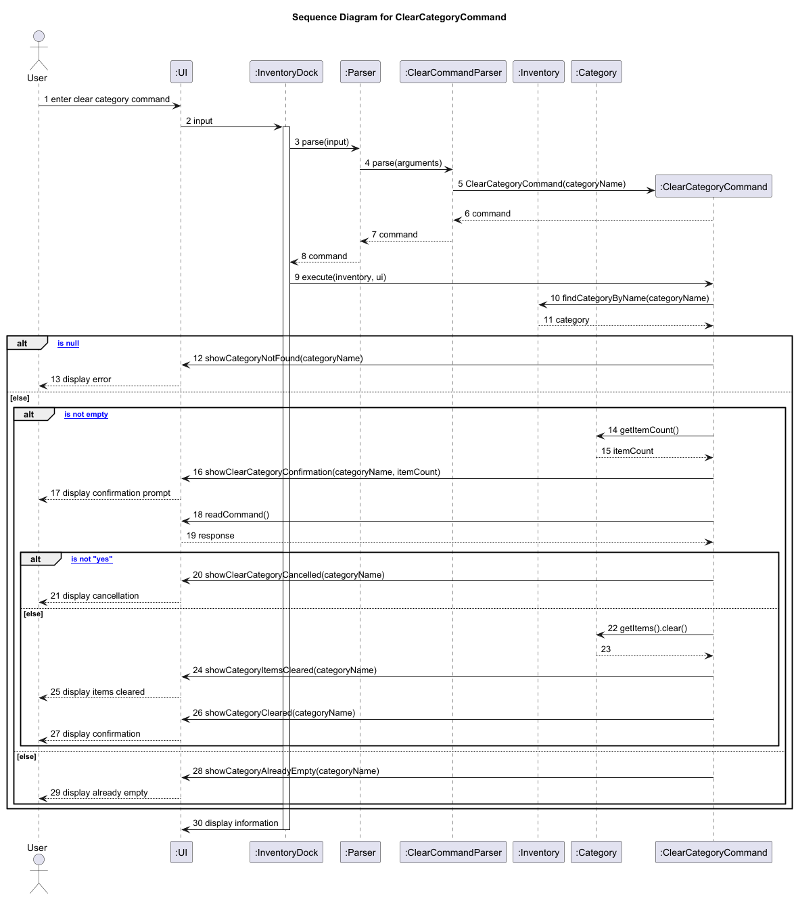

Class and object diagrams:
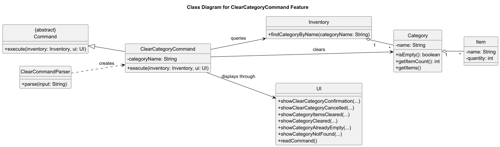
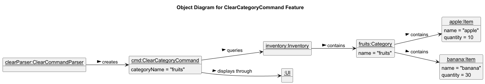

#### Design decisions
- **Index-based deletion** was chosen over name-based deletion because multiple items can share the same name.
- **Confirmation prompt** is used only for category clearing (high-risk), not for single-item deletion (low-risk, easily reversible).
- **Category clearing** removes items but preserves the category object, since categories are predefined.
- **Early return for empty categories** avoids a misleading "Cleared category" message when nothing was actually changed.
- The `clear` command word is used for category clearing, keeping it distinct from `delete` which is reserved for single-item removal by index.

### Help Feature

Command format: `help`
Displays a summary of available commands and a link to the User Guide. The command is intentionally minimal: `HelpCommand.execute()` delegates entirely to `ui.showHelp()`, which prints the command list and URL.
This design keeps help output concise and avoids duplicating detailed usage that already exists in the User Guide. The command summary is currently hard-coded in `UI.showHelp()`.

Sequence diagram:
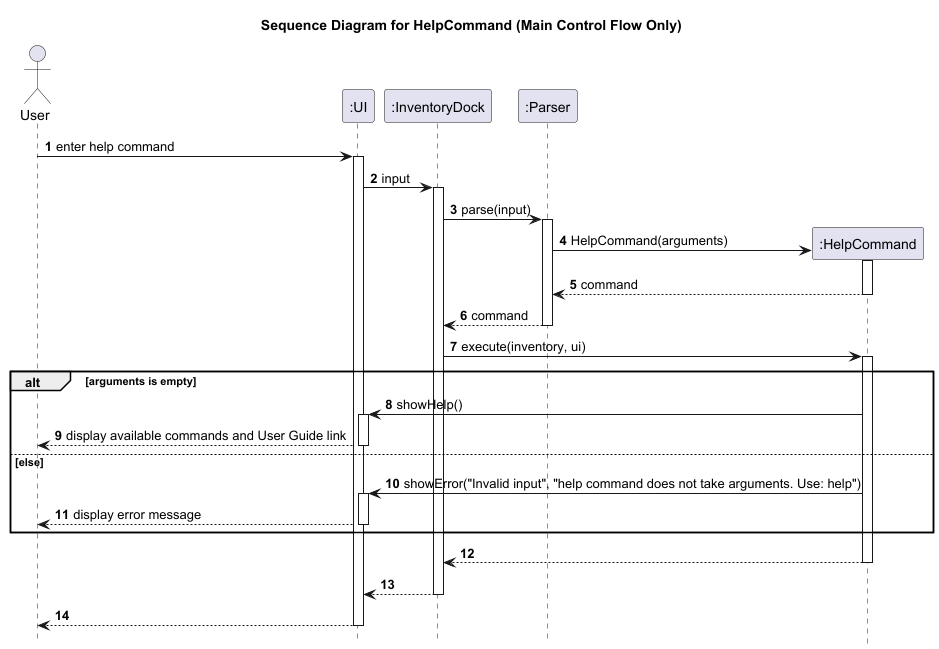

Class and object diagrams:


A possible future improvement is supporting `help COMMAND` to show detailed usage for a specific command.

## Product scope
### Target user profile

- Users who need to manage categorized inventory items
- Users who are comfortable using a Command Line Interface (CLI)
- Users who want to track item details such as quantity, location, and expiry date
- Store managers or individuals managing physical storage systems

### Value proposition

InventoryDock is a CLI-based inventory management system that allows users to efficiently manage categorized items 
with attributes such as bin location, quantity, and expiry date. It provides fast command-based operations for adding, 
updating, deleting, and searching items, enabling users to quickly locate and manage inventory without navigating 
complex interfaces.

## User Stories

| Version | As a ... | I want to ...             | So that I can ...                                           |
|---------|----------|---------------------------|-------------------------------------------------------------|
| v1.0    | new user | see usage instructions    | recover quickly when I forget the command format            |
| v1.0    | user     | view command help         | recover quickly when I am unsure what syntax to use         |
| v1.0    | user     | add items                 | sync real-world items into the system                       |
| v1.0    | user     | delete items              | remove entries that no longer reflect physical stock        |
| v1.0    | user     | clear a category          | remove all items from one category without deleting them one by one |
| v1.0    | user     | list items                | review the current inventory state in one place             |
| v1.0    | user     | have my inventory saved automatically | continue from my previous state after restarting the app |
| v2.0    | user     | find items by keyword     | locate a product quickly when I only remember part of its name |
| v2.0    | user     | find items by category    | inspect all items belonging to one category                 |
| v2.0    | user     | find items by bin         | check what is stored at a specific physical location        |
| v2.0    | user     | find items by quantity    | identify low-stock items that may need replenishment        |
| v2.0    | user     | find items by expiry date | identify batches that need attention before they expire     |
| v2.0    | user     | sort items                | review inventory in a meaningful order for faster scanning  |
| v2.0    | user     | update items              | correct data-entry mistakes without re-adding the whole item |
| v2.0    | user     | view an inventory summary | quickly identify low-stock or early-expiring items in each category |


## Non-Functional Requirements

1. The application should run on any system with Java 17 or above installed.
2. The system should handle small to moderate inventory sizes efficiently using linear scans.
3. The application should persist data between sessions using file storage.
4. The system should provide clear error messages for invalid user inputs.
   Error messages should use a consistent user-facing format with labels such as `Missing input`,
   `Invalid input`, `Not found`, `Conflict`, or `Storage error`.
5. The application should be usable via a Command Line Interface.
6. The system should not crash when encountering malformed storage data, and should handle such cases.

## Glossary

* *Item* - A unit stored in the inventory with attributes such as name, quantity, and expiry date.
* *Category* - A grouping of items within the inventory.
* *Bin* - A physical storage location identifier (e.g., A-10).
* *Inventory* - The overall collection of categories and items managed by the system.
* *Command* - A user input instruction that triggers an operation in the application.

## Instructions for manual testing

This section provides instructions for manually testing the application.

### Launching the application

1. Ensure that Java 17 or above is installed on your system.
2. Compile and run the `InventoryDock` class.
3. Verify that the application starts successfully and displays the welcome message.

### Adding sample data

1. Use the `add` command to insert sample items into different categories.
2. Example:
    - `add category/fruits item/apple bin/A-1 qty/10 expiryDate/2026-4-01 isRipe/true`
    - `add category/drinks item/cola bin/B-2 qty/5 expiryDate/2026-6-01 isCarbonated/true`
3. Run `list` to verify that the items are correctly added.

After setting up the application, proceed to the individual test cases below.

### Testing add item

1. Ensure the target category already exists in the inventory, for example `fruits`.
2. Run `add category/fruits item/apple bin/A-1 qty/10 expiryDate/2026-4-01 isRipe/true`.
3. Verify that the application shows a confirmation message for the added item.
4. Run `list`.
5. Verify that `apple` appears under the `fruits` category with the entered values.
6. Run `add category/unknown item/apple bin/A-1 qty/10 expiryDate/2026-4-01 isRipe/true`.
7. Verify that the application shows a `Invalid input` error for the invalid category.
8. Run an add command with a missing required field, for example `add category/fruits bin/A-1 qty/10 expiryDate/2026-4-01 isRipe/true`.
9. Verify that the application shows a `Missing input` error for the missing field.
10. Run `add category/fruits item/apple bin/B-9 qty/99 expiryDate/2026-4-01 isRipe/true`.
11. Verify that the application rejects it with a `Conflict` error for a duplicate logical batch.
12. Verify through `list` that no second identical batch was added to `fruits`.
13. Run `add category/fruits item/apple bin/C-1 qty/5 expiryDate/2026-4-02 isRipe/true`.
14. Verify through `list` that this different batch is allowed and appears under `fruits`.

### Testing list command

1. Start the application with at least one category containing items.
2. Run `list`.
3. Verify that the application displays the full inventory grouped by category.
4. Start the application with an empty inventory.
5. Run `list`.
6. Verify that the application still handles the command successfully and shows the inventory view for the empty state.

### Testing find by bin

1. Add items with bin locations such as `A-1`, `A-10`, and `B-10`.
2. Run `find bin/A-1`.
3. Verify that only items in bin `A-1` are shown, and items in `A-10` are not included.
4. Run `find bin/A`.
5. Verify that all items with matching bin letter `A` are shown.
6. Run `find bin/10`.
7. Verify that items in bins such as `A-10` and `B-10` are shown.
8. Run `find bin/Z`.
9. Verify that the application shows `No items found in bin location: z.` or the corresponding no-match message.

### Testing find by quantity

1. Add items with different quantities, for example `5`, `10`, `15`, and `30`.
2. Run `find qty/10`.
3. Verify that only items with quantity `10` or lower are shown.
4. Run `find qty/15`.
5. Verify that items with quantity `15` and lower are shown, and items above `15` are excluded.
6. Run `find qty/abc`.
7. Verify that the application shows the invalid input.
8. Run `find qty/5` when no item has quantity `5` or lower.
9. Verify that the application shows `No items found with quantity: 5.` or the corresponding no-match message.

### Testing find by category

1. Ensure the inventory contains a non-empty category such as `fruits` and an empty category if available.
2. Run `find category/fruits`.
3. Verify that the application shows the items stored in `fruits`.
4. Run `find category/FRUITS`.
5. Verify that the application still returns the items in `fruits`.
6. Run `find category/snacks` for an existing but empty category.
7. Verify that the application shows `No items found in category: snacks.`
8. Run `find category/car` for a category that does not exist.
9. Verify that the application shows the category-not-found message.

### Testing find by expiry date

1. Add items with different expiry dates.
2. Run `find expiryDate/2026-3-25`.
3. Verify that only items expiring on or before `2026-3-25` are shown.
4. Run `find expiryDate/2026-3-01`.
5. Verify that the application shows `No items found expiring by 2026-3-01.` when there are no matches.
6. Run `find expiryDate/2026/3/25`.
7. Verify that the application shows the invalid input error.
8. Run `find expiryDate/`.
9. Verify that the application shows the missing input error.

### Testing update feature

1. Run `update category/fruits index/1 newItem/green_apple bin/A-2 expiryDate/2026-5-01`
2. Verify that:
  * The item name is updated to green_apple  
  * The bin location is updated to A-2  
  * The expiry date is updated to 2026-5-01  
3. Run `list`.
4. Verify that all updated fields are reflected correctly.
5. Run `update category/unknown index/1 qty/10`
6. Verify that the application shows a `Not found` error for the missing category.
7. Run `update category/fruits index/100 qty/10`
8. Verify that the application shows an `Invalid input` error indicating the index is out of range.
9. Run `update category/fruits index/abc qty/10`
10. Verify that the application shows `Item index must be an integer.`
11. Run `update category/fruits index/1`
12. Verify that the application shows `at least one field to update is required.`
13. Run `update index/1 qty/10`
14. Verify that the application shows a `Missing input` error for the missing category.
15. Run `update category/fruits qty/10`
16. Verify that the application shows `item index is required.`
17. Run `update category/fruits index/1 qty/-5`
18. Verify that the application shows an `Invalid input` error for the invalid quantity.
19. Run `update category/fruits index/1 expiryDate/2026/05/01`
20. Verify that the application shows `Please enter a valid calendar date in yyyy-M-d format.`
21. Run `update category/fruits index/1 bin/`
22. Verify that the application shows `update token 'bin/' is invalid.`
23. Run `update category/fruits index/1 isRipe/false`
24. Verify that the application updates the fruit's ripe status successfully.

### Testing Sort Command
1. Add several items into at least one category with different names, expiry dates, and quantities.
2. Run `sort name`.
3. Verify that items within each category are shown in alphabetical order by name.
4. Run `sort expirydate`.
5. Verify that items within each category are shown from earliest to latest expiry date.
6. Run `sort qty`.
7. Verify that items within each category are shown from highest to lowest quantity.
8. Run `sort invalidType`.
9. Verify that the application shows the appropriate invalid sort type error message.
10. Run `sort` with no argument.
11. Verify that the application shows the missing sort type error message.
12. Run the command on an empty inventory.
13. Verify that the application handles it without crashing and displays the appropriate empty state.

### Testing storage

1. Add several items to the inventory.
2. Exit the application using the `bye` command.
3. Reopen the application.
4. Run `list`.
5. Verify that all items are restored with their correct category-specific boolean fields.
6. Exit the application using the `bye` command.
7. Modify the storage file so that a line is missing the `category/` field.
8. Reopen the application.
9. Verify that the application skips the malformed line and displays the appropriate error message.
10. Run `list`.
11. Verify that the remaining valid items are loaded correctly.
12. Exit the application using the `bye` command.
13. Delete the storage file before launching the application.
14. Verify that the application recreates the file automatically and starts without crashing.

### Testing clear category

1. Ensure the inventory contains a non-empty category such as `fruits`.
2. Run `clear category/fruits`.
3. Verify that the application shows a confirmation prompt with the item count.
4. Type `yes` and press enter.
5. Verify that the application shows a confirmation message indicating the category was cleared.
6. Run `list`.
7. Verify that the `fruits` category is now empty.
8. Run `clear category/fruits` again on the now-empty category.
9. Verify that the application shows "Category 'fruits' is already empty. Nothing to clear." without prompting for confirmation.
10. Run `clear category/unknown`.
11. Verify that the application shows the category-not-found error.
12. Add items back to `fruits`, then run `clear category/fruits`.
13. Type `no` and press enter.
14. Verify that the category is not cleared.

### Testing find by keyword

1. Add items with overlapping names such as `apple`, `pineapple`, and `apple_juice` across
   different categories.
2. Run `find keyword/apple`.
3. Verify that all items containing `apple` are shown, regardless of category.
4. Run `find keyword/APPLE`.
5. Verify that the search is case-insensitive and returns the same results.
6. Run `find keyword/chip`.
7. Verify that partial matches such as `chips` are returned.
8. Run `find keyword/mango`.
9. Verify that the application shows `No items found matching keyword: mango.` when there are no
   matches.

### Testing Summary Command

1. Add several items into at least one category with different quantities and expiry dates.
2. Run `summary`.
3. Verify that the application displays each category with its item count, tied lowest stock items, and tied earliest expiry items.
4. Run `summary stock`.
5. Verify that the application displays each category with its item count and tied lowest stock items only.
6. Run `summary expirydate`.
7. Verify that the application displays each category with its item count and tied earliest expiry items only.
8. Verify that item indices shown in the summary match the category-local indices shown in `list`. 
9. Run the command on an empty category. 
10. Verify that the application shows `N/A` for the corresponding summary fields.
11. Run `summary invalidType`. 
12. Verify that the application shows the appropriate invalid summary type error message.
